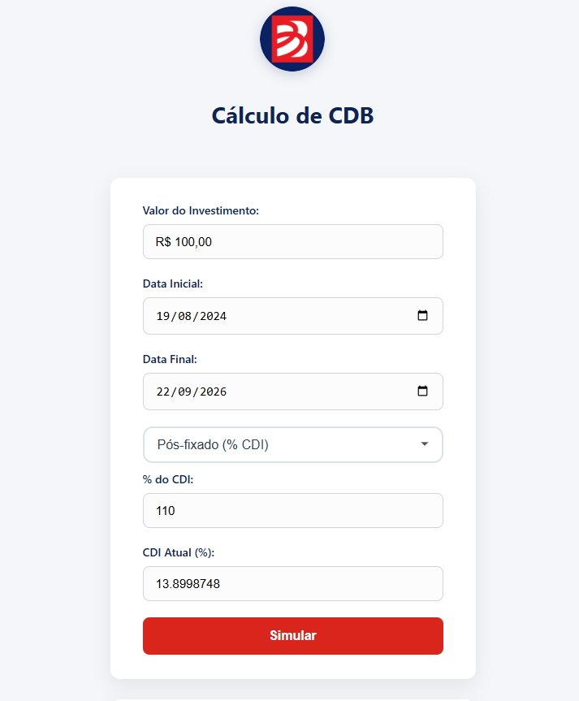
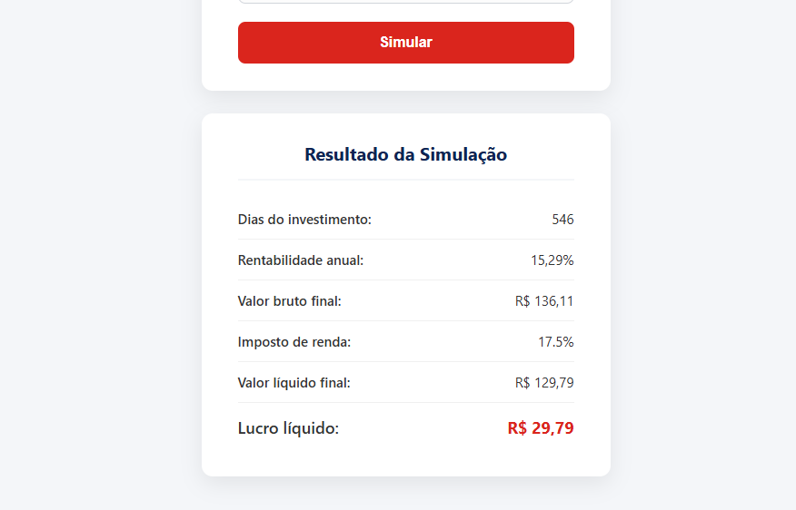

# 📊 Sistema Web para Simulação de Investimentos em CDB Prefixado e Pós-fixado

Aplicação web desenvolvida em **PHP, JavaScript, HTML e CSS** para simular a rentabilidade de investimentos em **Certificados de Depósito Bancário (CDB)**.

O sistema suporta atualmente dois modelos de CDB:

- **CDB pós-fixado**, remunerado por um percentual do CDI;
- **CDB prefixado**, remunerado por uma taxa anual definida pelo usuário.

Além da simulação financeira, o projeto possui integração com dados do **CDI disponibilizados pelo Banco Central do Brasil**, tratamento de datas, cálculo de juros compostos, Imposto de Renda regressivo, validação dos dados, formatação monetária e visualização da evolução do investimento em gráfico.

> [!IMPORTANT]
> Este projeto é de finalidade educacional e de simulação. Os valores apresentados são estimativas matemáticas que funciona
como uma calculadora.

---

## 📑 Sumário

- [Sobre o projeto](#-sobre-o-projeto)
- [Objetivo](#-objetivo)
- [Interface](#-interface)
- [CDB pós-fixado](#-cdb-pós-fixado)
- [CDB prefixado](#-cdb-prefixado)
- [Integração com o CDI](#-integração-com-o-cdi)
- [CDI histórico e projeção](#-cdi-histórico-e-projeção)
- [Anualização do CDI](#-anualização-do-cdi)
- [Cálculo da rentabilidade](#-cálculo-da-rentabilidade)
- [Dias úteis](#-dias-úteis)
- [Imposto de Renda](#-imposto-de-renda)
- [Evolução do investimento](#-evolução-do-investimento)
- [Validações](#-validações)
- [Formatação monetária](#-formatação-monetária)
- [Tecnologias](#-tecnologias-utilizadas)
- [Arquitetura e fluxo](#-arquitetura-e-fluxo)
- [Como executar](#-como-executar)

---

# 📌 Sobre o projeto

A proposta do sistema é facilitar a compreensão da rentabilidade de um CDB.

Em vez de o usuário precisar calcular manualmente juros compostos, CDI, prazo e tributação, a aplicação recebe os dados da operação e apresenta o resultado de forma organizada.

Os principais dados utilizados são:

- valor do investimento;
- data inicial;
- data final;
- modalidade do CDB;
- percentual do CDI, para CDB pós-fixado;
- taxa anual, para CDB prefixado;
- CDI utilizado na simulação.

Ao final, são apresentados:

- dias considerados no investimento;
- rentabilidade anual;
- valor bruto;
- alíquota do Imposto de Renda;
- valor líquido;
- lucro líquido;
- evolução do patrimônio.

---

# 🎯 Objetivo

O objetivo principal é desenvolver uma ferramenta web capaz de realizar simulações de CDB de maneira simples e automatizada, utilizando conceitos reais do mercado de renda fixa.

O projeto também foi utilizado para praticar:

- Programação Orientada a Objetos em PHP;
- integração entre frontend e backend;
- APIs HTTP;
- JSON;
- JavaScript assíncrono com `fetch()`;
- validação de formulários;
- tratamento de datas;
- cálculos financeiros;
- BCMath;
- interfaces responsivas;
- gráficos;
- tratamento de erros.

---

# 🖥️ Interface

## Formulário

A página principal reúne os campos necessários para a simulação.



O formulário permite escolher entre:

```text
Pós-fixado (% CDI)
Prefixado
```

A interface altera dinamicamente os campos de acordo com a opção escolhida.

### Quando o usuário seleciona Pós-fixado

São utilizados:

```text
% do CDI
CDI Atual / CDI calculado
```

### Quando o usuário seleciona Prefixado

É utilizado:

```text
Taxa Anual (%)
```

Os campos que não pertencem à modalidade selecionada são desabilitados para que não sejam enviados indevidamente no `POST`.

---

## Resultado

Após a simulação, o sistema apresenta um resumo financeiro da operação.



O painel apresenta:

| Resultado | Significado |
|---|---|
| Dias do investimento | Quantidade de dias úteis calculados no período |
| Rentabilidade anual | Rentabilidade anual utilizada na operação |
| Valor bruto final | Patrimônio antes do IR |
| Imposto de renda | Alíquota aplicável ao prazo |
| Valor líquido final | Patrimônio após o IR |
| Lucro líquido | Ganho líquido sobre o capital inicial |

---

# 💹 CDB Pós-fixado

No modelo pós-fixado, a rentabilidade depende do CDI.

Exemplo:

```text
CDI anual = 13,90%
CDB = 110% do CDI
```

O percentual informado pelo usuário é convertido:

```text
110% → 1,10
```

Depois:

```text
13,90 × 1,10 = 15,29% a.a.
```

No código, a ideia é equivalente a:

```php
$percentual = bcdiv(
    $this->CDI,
    "100",
    $this->scale
);

$rentabilidade = bcmul(
    $this->CDI_ATUAL,
    $percentual,
    $this->scale
);
```

Assim, o CDI é o indexador e o percentual do CDI determina quanto do índice o CDB remunera.

---

# 🔒 CDB Prefixado

No CDB prefixado, a taxa já é conhecida no momento da simulação.

Exemplo:

```text
Taxa prefixada = 15% a.a.
```

Nesse cenário, o CDI não participa da definição da rentabilidade.

A rentabilidade anual é simplesmente a taxa informada:

```php
$rentabilidade = $this->Taxa_Prefixada;
```

Depois dessa etapa, o mesmo motor de juros compostos utilizado pelo pós-fixado pode continuar sendo usado.

Isso evita duplicação de código.

---

# 🌐 Integração com o CDI

O sistema consulta o **Sistema Gerenciador de Séries Temporais (SGS)** do Banco Central do Brasil.

A série utilizada no projeto é:

```text
SGS 12 — Taxa de juros - CDI
Unidade: % ao dia
Periodicidade: diária
```

A API retorna registros semelhantes a:

```json
[
    {
        "data": "03/01/2025",
        "valor": "0.045513"
    },
    {
        "data": "06/01/2025",
        "valor": "0.045513"
    }
]
```

O campo `valor` representa uma **taxa percentual diária**, e não uma taxa anual.

Por isso, antes de utilizar esse valor como CDI anual na interface, o backend realiza a anualização.

---

# 🕒 CDI histórico e projeção

O projeto possui duas situações para o CDB pós-fixado.

## Histórico

Quando a regra do sistema identifica que a simulação começa em uma data passada, é feita uma consulta ao período histórico informado.

Exemplo:

```text
Data inicial: 03/01/2025
Data final:   08/08/2025
```

Em um teste realizado durante o desenvolvimento, a API retornou:

```text
150 registros
```

com valores diários entre as duas datas.

O sistema calcula uma taxa diária representativa do período e a transforma em uma taxa anual equivalente.

Exemplo observado no desenvolvimento:

```text
Média diária: 0,0518443733%
CDI anualizado: aproximadamente 13,95% a.a.
```

## Projeção

Quando a simulação utiliza o cenário atual/futuro, não existe CDI futuro conhecido.

Nesse caso, o sistema consulta o último CDI diário disponível e considera sua taxa anual equivalente como base da projeção.

Exemplo:

```text
Taxa diária = 0,053400%
```

Anualizada, essa taxa fica próxima de:

```text
14,40% a.a.
```

O resultado é uma **projeção**, pois o CDI pode variar ao longo do período futuro.

---

# 🧮 Anualização do CDI

Como a série 12 fornece o CDI em **percentual ao dia**, é necessário convertê-lo para uma taxa anual equivalente.

O mercado financeiro brasileiro utiliza a convenção de aproximadamente:

```text
252 dias úteis por ano
```

A conversão utilizada é:

```text
CDI anual = ((1 + taxa diária) ^ 252 - 1) × 100
```

No PHP:

```php
$cdi = (
    pow(
        1 + ($taxa_diaria / 100),
        252
    ) - 1
) * 100;
```

Por exemplo:

```text
Taxa diária: 0,0534%
Taxa anual equivalente: aproximadamente 14,40%
```

### Histórico

Na implementação histórica atualmente utilizada, o sistema calcula primeiro a média das taxas diárias recebidas:

```php
$soma = 0;

foreach ($dados as $registro) {
    $soma += (float)$registro['valor'];
}

$media_diaria =
    $soma / count($dados);
```

Depois anualiza:

```php
$cdi_anual =
(
    pow(
        1 + ($media_diaria / 100),
        252
    ) - 1
) * 100;
```

> [!NOTE]
> A média diária anualizada é uma aproximação útil para obter uma taxa anual representativa do período. Para reconstruir a rentabilidade histórica efetiva com maior rigor, uma evolução futura do projeto pode compor cada taxa diária individualmente.

---

# 💰 Cálculo da rentabilidade

Após determinar a rentabilidade anual — seja pelo CDI ou pela taxa prefixada — o sistema converte essa taxa anual em uma taxa diária equivalente.

Exemplo:

```php
$rentabilidade_decimal = bcdiv(
    $rentabilidade,
    "100",
    $this->scale
);

$taxa_diaria = pow(
    1 + (float)$rentabilidade_decimal,
    1 / 252
) - 1;
```

Em seguida:

```text
base = 1 + taxa diária
```

E o valor final bruto é calculado por juros compostos:

```text
Valor final = Valor inicial × (1 + taxa diária) ^ dias úteis
```

No projeto, BCMath é utilizado para preservar a precisão das operações decimais sempre que possível.

---

# 📅 Dias úteis

O período do investimento é calculado a partir das datas escolhidas pelo usuário.

A função atual percorre o intervalo e conta segunda a sexta-feira:

```php
while ($inicio < $fim) {

    $dia_semana =
        $inicio->format('N');

    if ($dia_semana < 6) {
        $dias_uteis++;
    }

    $inicio->modify('+1 day');
}
```

Portanto:

```text
1 a 5 → considerados
6 → sábado
7 → domingo
```

O número de dias úteis reais da simulação pode ser diferente de 252.

Isso não é um erro.

Os **252 dias** representam a convenção utilizada para transformar uma taxa anual em uma taxa diária.

Já a variável:

```text
$dias
```

representa a duração efetiva calculada para a simulação.

---

# 🧾 Imposto de Renda

CDB possui tributação regressiva sobre o rendimento.

A tabela usada como referência é:

| Prazo | Alíquota |
|---|---:|
| Até 180 dias | 22,5% |
| 181 a 360 dias | 20% |
| 361 a 720 dias | 17,5% |
| Acima de 720 dias | 15% |

O sistema calcula inicialmente:

```text
Lucro bruto = Valor bruto final - Valor investido
```

Depois:

```text
Imposto = Lucro bruto × alíquota
```

E:

```text
Valor líquido = Valor bruto - Imposto
```

Finalmente:

```text
Lucro líquido = Valor líquido - Valor investido
```

---

# 📈 Evolução do investimento

Além de calcular apenas o resultado final, o sistema cria uma sequência intermediária de valores para mostrar a evolução do patrimônio.

A lógica percorre os dias da operação:

```php
$evolucao = [];

$valor_atual =
    $this->Valor;

for ($i = 1; $i <= $dias; $i++) {

    $valor_atual = bcmul(
        $valor_atual,
        $base,
        $this->scale
    );

    if (
        $i === 1 ||
        $i % 30 === 0 ||
        $i === $dias
    ) {

        $evolucao[] = [
            'dia' => $i,
            'valor' => round(
                (float)$valor_atual,
                2
            )
        ];
    }
}
```

A saída possui formato semelhante a:

```json
[
    {
        "dia": 1,
        "valor": 1000.54
    },
    {
        "dia": 30,
        "valor": 1016.23
    },
    {
        "dia": 60,
        "valor": 1032.71
    }
]
```

Esses dados são utilizados pelo **Chart.js** para montar um gráfico de linha.

O gráfico permite ao usuário visualizar o crescimento do patrimônio ao longo do prazo escolhido.

---

# ✅ Validações

O backend valida os campos antes de realizar os cálculos.

## Valor

O valor deve:

- estar preenchido;
- possuir formato numérico válido;
- ser maior que zero.

## Datas

As datas devem:

- possuir formato válido;
- possuir uma ordem válida;
- permitir a realização da simulação.

## Pós-fixado

Quando:

```text
tipo_cdb = posfixado
```

o sistema trabalha com:

- percentual do CDI;
- CDI calculado/consultado.

A taxa prefixada não é necessária.

## Prefixado

Quando:

```text
tipo_cdb = prefixado
```

a taxa anual prefixada:

- deve existir;
- deve ser numérica;
- deve ser maior que zero.

Os campos relacionados ao CDI deixam de participar da operação.

---

# 💵 Formatação monetária

Para melhorar a experiência do usuário, o valor digitado no formulário pode ser apresentado no formato brasileiro:

```text
100000 → R$ 1.000,00
```

A máscara é aplicada apenas na interface.

Antes da validação no PHP, caracteres de formatação são removidos:

```php
$valor = preg_replace(
    '/[^\d,.]/',
    '',
    $_POST['valor'] ?? ''
);

$valor =
    str_replace('.', '', $valor);

$valor =
    str_replace(',', '.', $valor);
```

Assim:

```text
R$ 1.000,00
```

é convertido para:

```text
1000.00
```

formato adequado para validação e operações matemáticas.

---

# 🔄 Comunicação JavaScript ↔ PHP

A consulta dinâmica do CDI é realizada sem a necessidade de recarregar toda a página.

O JavaScript envia as datas para uma API PHP:

```javascript
fetch(
    '/CURSO_PHP/CDB_System/Public/api/cdi-api.php',
    {
        method: 'POST',

        headers: {
            'Content-Type':
                'application/json'
        },

        body: JSON.stringify({
            data_inicial:
                dataInicial.value,

            data_final:
                dataFinal.value
        })
    }
);
```

A API processa os dados e responde em JSON:

```json
{
    "status": "sucesso",
    "tipo": "projecao",
    "cdi": 14.4,
    "registros": 1
}
```

O JavaScript pode formatar visualmente:

```javascript
Number(dados.cdi).toFixed(2);
```

Assim:

```text
14.4
```

é apresentado como:

```text
14.40
```

sem alterar o valor matemático.

---

# 🔀 Alternância Prefixado / Pós-fixado

O formulário utiliza JavaScript para mostrar somente os campos relevantes.

Quando o tipo é prefixado:

```text
Taxa prefixada → habilitada
CDI → desabilitado
CDI atual → desabilitado
```

Quando o tipo é pós-fixado:

```text
Taxa prefixada → desabilitada
CDI → habilitado
CDI atual → habilitado
```

O uso de:

```javascript
input.disabled = true;
```

é importante porque campos desabilitados **não são enviados pelo formulário**.

Isso evita que uma taxa prefixada antiga seja enviada junto com uma simulação pós-fixada e vice-versa.

---

# 🛡️ Tratamento de erros

A API retorna erros em formato estruturado.

Exemplo:

```json
{
    "status": "erro",
    "erros": {
        "Data_Erro": [
            "AS DATAS DEVEM ESTAR NO FORMATO YYYY-MM-DD E SEREM VÁLIDAS"
        ]
    }
}
```

No frontend, essas mensagens podem ser apresentadas ao usuário sem expor detalhes internos do PHP.

Também foi prevista uma página específica de erro para evitar que mensagens como:

```text
Fatal error
Warning
TypeError
```

sejam exibidas diretamente em um ambiente de produção.

---

# 🧰 Tecnologias utilizadas

| Tecnologia | Utilização |
|---|---|
| PHP | Backend, validação e regras financeiras |
| BCMath | Operações decimais com maior controle de precisão |
| JavaScript | Interface dinâmica e consumo da API |
| Fetch API | Comunicação assíncrona frontend/backend |
| HTML5 | Estrutura das páginas |
| CSS3 | Layout e estilização |
| Chart.js | Gráfico de evolução do investimento |
| JSON | Troca de dados entre PHP e JavaScript |
| DateTime | Manipulação e comparação de datas |
| Banco Central do Brasil / SGS | Fonte dos dados diários do CDI |
| XAMPP / Apache | Ambiente local de desenvolvimento |

---

# 🏛️ Arquitetura e fluxo

Uma visão simplificada:

```text
┌─────────────────────────────┐
│           Usuário           │
└──────────────┬──────────────┘
               │
               ▼
┌─────────────────────────────┐
│      Formulário HTML        │
│ Valor / Datas / Tipo CDB    │
└──────────────┬──────────────┘
               │
       ┌───────┴────────┐
       │                │
       ▼                ▼
   Prefixado        Pós-fixado
       │                │
 Taxa anual         % do CDI
       │                │
       │          API PHP do CDI
       │                │
       │          Banco Central
       │                │
       └───────┬────────┘
               ▼
┌─────────────────────────────┐
│        Validação PHP        │
└──────────────┬──────────────┘
               ▼
┌─────────────────────────────┐
│    Motor de cálculo CDB     │
│  Taxa diária / Juros / IR   │
└──────────────┬──────────────┘
               ▼
┌─────────────────────────────┐
│       Resultado final       │
│ Bruto / Líquido / Lucro     │
└──────────────┬──────────────┘
               ▼
┌─────────────────────────────┐
│     Gráfico de evolução     │
└─────────────────────────────┘
```
---

# 🚀 Como executar

## Requisitos

- PHP 8.2 ou superior;
- Apache;
- extensão BCMath;
- acesso à internet para consultar o CDI;
- navegador.

## Usando XAMPP

Clone o repositório dentro de:

```text
C:\xampp\htdocs\
```

Exemplo:

```text
C:\xampp\htdocs\CURSO_PHP\CDB_System
```

Inicie o Apache no XAMPP.

Depois acesse:

```text
http://localhost/CURSO_PHP/CDB_System/Public/
```

---

## BCMath

Confirme que a extensão está habilitada no `php.ini`.

```ini
extension=bcmath
```

Depois de alterar o arquivo, reinicie o Apache.

---

## Acesso HTTPS externo pelo PHP

Como a aplicação consulta uma API externa, o PHP precisa conseguir realizar requisições HTTPS.

Caso seja utilizado `file_get_contents()` para acessar URLs externas, a configuração:

```ini
allow_url_fopen=On
```

precisa estar habilitada.

Outra alternativa é utilizar **cURL**, que fornece maior controle sobre requisições HTTP e tratamento de erros.

---

# 🧪 Exemplo de simulação pós-fixada

Entrada:

```text
Valor: R$ 100,00
Data inicial: 19/08/2024
Data final: 22/09/2026
Tipo: Pós-fixado
Percentual: 110% do CDI
CDI anual utilizado: aproximadamente 13,90%
```

Saída apresentada na interface de referência:

```text
Dias do investimento: 546
Rentabilidade anual: 15,29%
Valor bruto final: R$ 136,11
IR: 17,5%
Valor líquido final: R$ 129,79
Lucro líquido: R$ 29,79
```

Os valores dependem das regras e dados disponíveis no momento da simulação.

---

# 📚 Fonte dos dados do CDI

O projeto utiliza a série temporal oficial do Banco Central do Brasil:

**Sistema Gerenciador de Séries Temporais (SGS) — Série 12 — Taxa de juros - CDI — percentual ao dia.**

Documentação e dados oficiais podem ser consultados no portal do Banco Central do Brasil.

---

# 👨‍💻 Finalidade acadêmica

Este sistema foi desenvolvido com finalidade de estudo e demonstração prática.

O projeto reúne diferentes áreas de desenvolvimento de software:

```text
Frontend
+
Backend
+
API
+
Cálculos financeiros
+
Validação
+
Tratamento de erros
+
Visualização de dados
```

A proposta é demonstrar como informações financeiras podem ser processadas e apresentadas em uma aplicação web de maneira clara e automatizada.

---

# 📄 Licença

Defina uma licença no repositório caso deseje permitir reutilização, modificação ou distribuição do código.

Algumas opções comuns para projetos de estudo são:

```text
MIT
Apache-2.0
```

Antes de escolher uma licença, verifique qual modelo atende melhor aos objetivos do projeto.
